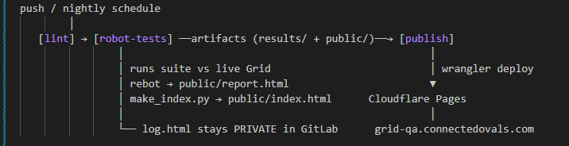

# grid-qa

Automated test suite for my production habit-tracker **Grid**
(https://grid.connectedovals.com) — Robot Framework + custom Python
keyword libraries, executed nightly by GitLab CI, results published to
**https://grid-qa.connectedovals.com**.

## What it tests
- API & auth behaviour of the live app (Supabase): login flow, RLS row
  isolation, negative auth scenarios (missing key vs missing token)
- Network layer: DNS resolution, TLS certificate validity window,
  port exposure (incl. negative checks)
- Toolchain smoke tests

## How it works

lint (ruff + RF dryrun) → test (live suite, artifacts) → publish
(rebot-sanitized report + generated summary page → Cloudflare Pages)

## Design decisions
- Execution log (log.html) is deliberately NOT published — request-level
  data stays in private CI artifacts; the public site gets a rebot-built
  report without it.
- Suite fails honestly (exit-code capture) while reporting always publishes —
  a red night is visible by design.
- Dedicated email/password test user because OAuth isn't automatable
  server-side; secrets injected via env vars locally / masked CI variables.

## Running locally
[venv, requirements, set-env.ps1 pattern (values not included), robot command]

## Stack
Robot Framework · Python 3.12 · RequestsLibrary · ruff · GitLab CI ·
Cloudflare Pages · Supabase (system under test)